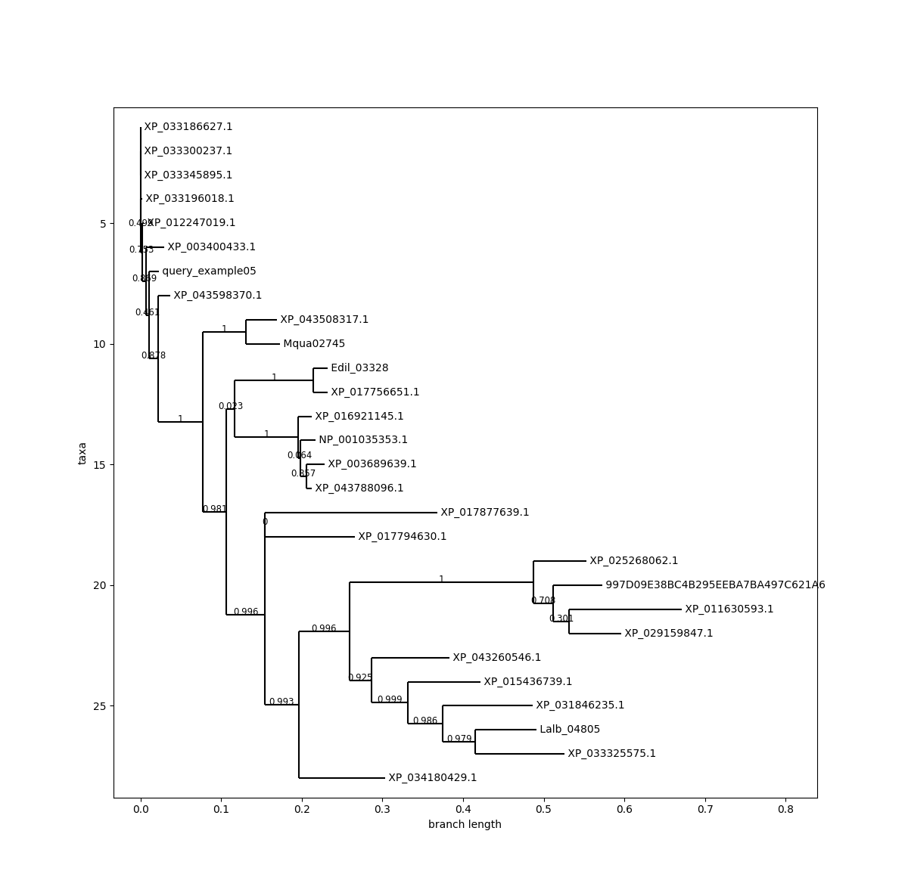
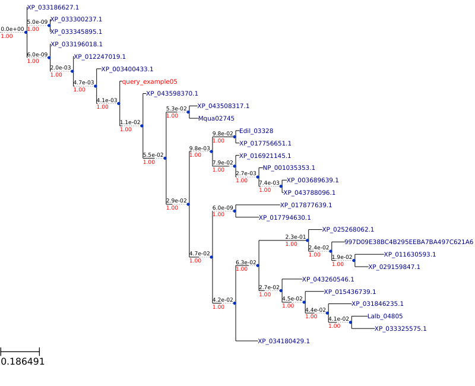

# inprotfind    

A workflow for insect protein identification and phylogenetic analyses.

- Documentation
- GitHub
- PyPI
- License (BSD)


## Features

- **Cross-Platform**: Supports Linux (AMD and Aarch) and MacOS (Intel and Silicon)
- **Versatile**: Compatible with Python 3.6 to 3.12
- **Flexible**: Can be used both within Python scripts and directly from the terminal through shell scripting 


## Prerequisites

**inprotfind** requires _mmseqs2_, _mafft_, _fasttree_, _ete3_ and _streamlit_ installed in the same environment to work properly. The five tools can be easily installed using [_conda_](https://docs.anaconda.com/miniconda/) and it is the option recommended (especially for _ete3_, as other installing tools (as _pip_) do not install all the required dependencies). They can be installed all at once with:

```bash
conda install mmseqs2 mafft fasttree ete3 streamlit -y
```

or one by one:

#### [_mmseqs2_](https://github.com/soedinglab/MMseqs2?tab=readme-ov-file)

```
conda install bioconda::mmseqs2
```

#### [_mafft_](https://mafft.cbrc.jp/alignment/server/index.html)

```
conda install bioconda::mafft
```

#### [_FastTree_](http://www.microbesonline.org/fasttree/)

```
conda install bioconda::fasttree
```
#### [_ete3_](http://etetoolkit.org/)
```
conda install conda-forge::ete3
```
#### [_streamlit_](https://streamlit.io/)
```
conda install conda-forge::streamlit
```
## Installing inprotfind

Install **inprotfind** with pip from the GitHub repository:

```bash
  pip install inprotfind

  pip install git+https://github.com/carmelogzmz/inprotfind.git
```
    
## Using inprotfind

**inprotfind** includes a series of functions that allow you to compare a query protein sequence against a database containing over four million insect protein sequences (using the _find_matches_ function) to identify the potential type of protein and its possible species, genus, or family. Additionally, after aligning the most similar sequences (_align_sequences_ function), it can place the query sequence in a phylogenetic context alongside the most similar sequences from the database (_build_tree_ function).

### main functions

The following three functions allow the user to go through the complete workflow, from the query protein sequence to the tree where the query sequence is located in a phylogenetic context:

#### 1. get\_database()

Since the database weighs around 1.5 Gb, it is not included by default when the library is installed due to restrictions in library repositories such as PyPi or GitHub. Therefore, once the library is installed, you just have to execute `get_database()` to download and install the necessary database.

_Python:_

```python
import inprotfind as ipf

ipf.get_database()
```

_Shell:_

```bash
inprotfind get_database
```
Once executed, the database, named _arthropods_OrthoDB_ is downloaded and subsequently installed in the directory where the **inprotfind** library was installed in the current environment.

#### 2. find\_matches(job\_name, query\_path, evalue = 0.0000000001, min_seq_id = 0.7)

It requires four arguments:

- `job_name` requires a name, chosen entirely by the user, to identify the search or task to be performed (e.g., Task01, BeeProtein, ProjectArboVirus, etc.). It is recommend that the user choose an informative name, to easy identification. The function creates a folder (in the working directory) with the same name where all the files created during the execution are stored. 
- `query_path` requires the path where the file with the query protein sequence (a **fasta file**).
- `evalue` requires the E-value threshold. the E-value is used to evaluate the significance of the sequences' similarity. It is set by default to 1e-10 (0.0000000001).
- `min_seq_id` requires the minimum percentage of identity for two sequences to be considered homologous. It is by set by default to 0.7.

NOTE: _If the `evalue` and/or the `min_seq_id` were not passed by the user, the default values are used_

As an example, if the user wants to name the task as _BeeProtein01_, and the fasta file with the query protein sequence is in */home/{USER}/BeeProject/queries/query\_Bee01.fasta* the code will be:

_Python:_

```python
import inprotfind as ipf

ipf.find_matches("BeeProtein01", "home/USER/BeeProject/queries/query_Bee01.fasta")
```

_Shell:_

```bash
inprotfind find_matches --job_name BeeProtein01 --query_path home/USER/BeeProject/queries/query_Bee01.fasta
```

Once the function is executed, it creates a folder named "BeeProtein01" (in the working directory) where all the files created during the execution are stored. The main result files are _best\_matches\_all.m8_, with the metadata of the 100 more similar sequences from the target database, and _best\_matches.m8_ with just the metadata of just the 30 first sequences included in _best\_matches\_all.m8_. 

_NOTE: if_ find\_matches _is executed but the database is not downloaded and installed, it will install it (by calling the function_ get\_database) _before start with any analysis._

#### 3. align\_sequences(job\_name)

It only requires the `job_name` argument to select the files on which to apply the function. 

Following the same example from the previous function:

_Python:_
```python
import inprotfind as ipf

ipf.align_sequences("BeeProtein01")
```

_Shell:_
```bash
inprotfind align_sequences --job_name BeeProtein01
```

Once the function is executed, it collects the sequences which accession code is in _best\_matches.m8_, and add the query protein sequence in a multifasta file (_filtered\_sequences.fasta_), and then aligns the sequences using MAFFT (_aligned\_sequences.fasta_). Both _filtered\_sequences.fasta_ and _aligned\_sequences.fasta_ are stored in the "BeeProtein01" folder.

#### 4. build\_tree(job\_name, tree_type = "simple")

It requires two arguments:

- `job_name` is required to find the _aligned\_sequences.fasta_ file. 
- `tree_type` can be `"simple"`, `"interactive"` or `"ascii"`. `"simple"`is selected by default, and plot a simple and static phylogenetic tree in a pop-up window (or in the Plots panel if using an IDE with this feature). `"interactive"`use the _ete3_ library to open the ete3 software and plot an interactive phylogenetic tree with different visualization options. `"ascii"` shows the phylogenetic tree directly drawn in the python console or in the terminal.

Finishing with the example, if the user selects `"interactive"`:

_Python:_

```python
import inprotfind as ipf

ipf.build_tree("BeeProtein01", "interactive")
```

_Shell:_

```bash
inprotfind build_tree --job_name BeeProtein01 --tree_type interactive
```

Once the function is exectuted, it creates a file named _tree.nwk_ (in the folder "BeeProtein01"). Then open the _ete3_ interface and plot the interactive phylogenetic tree.

#### 5. show\_results(job\_name)

It only requires the `job_name` argument to select the files on which to apply the function. 

Following the same example from the previous function:

_Python:_
```python
import inprotfind as ipf

ipf.show_restuls("BeeProtein01")
```

_Shell:_
```bash
inprotfind show_results --job_name BeeProtein01
```

Once the function is executed, the default browser opens and shows the results from the homology searching (_best_matches.m8_) and the phylogenic tree. It also save a _tree.png_ file in the job folder with the tree drawn.


### complementary functions

There are few secondary functions that run within the main functions to secure that all the dependencies and tools are correctly installed. 

- **verifying_mmseqs2()** checks if _MMseqs2_ is installed in the working environment.
- **verifying_mafft()** checks if _MAFFT_ is installed in the working environment.
- **verifying_fasttree()** checks if _FastTree_ is installed in the working environment.

If any of these tools is not installed, the execution stops and ask the user to install it.

## Workflow example

**inprotfind** includes ten query protein sequences as examples for the user to learn how to properly use the library. To use the examples, it is enough to use the word "example" followed by a number from 1 to 10 as argument for the `query_path`in the _find\_matches_ function. We now will use the example number 5 to run the complete workflow and get some results. We will name the task as "QueryExample5":

#### 1. Searching similar sequences in the target database

```python
import inprotfind as ipf

ipf.find_matches(job_name = "QueryExample5", query_path = "example5")
```

 _Notice that when using one of the ten examples, we are not passing a path as argument to `query_path`but just a string saying "example1", "example2"... "example10". In this example we use "example5". The function recognizes that we are asking to work with an example and it will recover it from the directory where the library is installed._

Let's have a look to the content of the "QueryExample5" folder. It should look like this:

```
.
└── QueryExample5/
    ├── queryDB/
    │   ├── queryDB
    │   ├── queryDB.dbtype
    │   ├── queryDB.index
    │   ├── queryDB.lookup
    │   ├── queryDB.source
    │   ├── queryDB_h
    │   ├── queryDB_h.dbtype
    │   └── queryDB_h.index
    ├── resultDB/
    │   ├── resultDB
    │   ├── resultDB.dbtype
    │   └── resultDB.index
    ├── best_matches.m8
    └── best_matches_all.m8
```

It contains the folders named _queryDB_ and _resultDB_ with the query sequence in mmseqs2 format and a database in mmseqs2 format with the 100 more similar sequences from the target database. Lastly, it also contains the files _best\_matches_all.m8_, with the metadata of the 100 similar sequences, and _best\_matches.m8_ with the first 30 more similar sequences. Let's see the first 10 lines of _best\_matches.m8_:

```
qseqid	        tseqid	        pident	length	mismatch    gapopen	qstart	qend	tstart	tend	evalue	    bitscore	organism	                        genomeid	    geneid	        description
query_example05	XP_033196018.1	0.948	499	    26	        0	    1	    498	    1	    499	    0.0	        995	        Bombus_vancouverensis_nearcticus	GCF_011952275.1	LOC117159921	cystathionine_beta-synthase-like_isoform_X1
query_example05	XP_012247019.1	0.947	499	    26	        0	    1	    498	    1	    499	    0.0	        994	        Bombus_impatiens	                GCF_000188095.3	LOC100741040	Cystathionine_beta-synthase
query_example05	XP_033345895.1	0.946	499	    27	        0	    1	    498	    1	    499	    0.0	        993	        Bombus_vosnesenskii	                GCF_011952255.1	LOC117231499	Cystathionine_beta-synthase
query_example05	XP_033300237.1	0.946	499	    27	        0	    1	    498	    1	    499	    0.0	        993	        Bombus_bifarius	                    GCF_011952205.1	LOC117205676	Cystathionine_beta-synthase
query_example05	XP_043598370.1	0.936	499	    32	        0	    1	    498	    1	    499	    1.084e-320	980	        Bombus_pyrosoma	                    GCF_014825855.1	122574643	    cystathionine_beta-synthase_isoform_X1
query_example05	XP_033186627.1	0.897	523	    51	        0	    1	    498	    1	    523	    2.036e-320	979	        Bombus_vancouverensis_nearcticus	GCF_011952275.1	LOC117155128	cystathionine_beta-synthase-like_isoform_X1
query_example05	XP_003400433.1	0.931	499	    34	        0	    1	    498	    1	    499	    8.915e-319	975	        Bombus_terrestris	                GCF_910591885.1	LOC100644376	Cystathionine_beta-synthase
query_example05	XP_043788096.1	0.854	495	    72	        0	    1	    493	    1	    495	    7.385e-285	877	        Apis_laboriosa	                    GCF_014066325.1	122712463	    cystathionine_beta-synthase
query_example05	XP_043508317.1	0.852	495	    73	        0	    1	    495	    1	    493	    4.884e-284	874	        Frieseomelitta_varia	            GCF_011392965.1	122527834	    cystathionine_beta-synthase
query_example05	XP_016921145.1	0.851	495	    73	        0	    1	    493	    1	    495	    1.721e-283	873	        Apis_cerana	                        GCF_001442555.1	LOC108003422	cystathionine_beta-synthase
```

The file follows a similar tabular BLAST file (`m8`) with few columns more with some metadate. The colums are:

- qseqid
- tseqid
- pident
- length
- mismatch
- gapopen
- qstart
- qend
- tstart
- tend
- evalue
- bitscore
- organism
- genomeid
- proteinid
- geneid
- description

We see that the first match has a 94.8% of similarity. The first protein is described as _cystathionine beta-synthase-like isoform X1a_ belonging to _Bombus vancouverensis nearticus_. While we cannot say 100% sure that our query sequence belongs to this species, seeing the ten first species (all of then bees) we likely could say that is a bee, and from the _Bombus_ genus -commonly named Bumblebees- (at the end of the exampe we will know the real metadata of this sequences)

#### 2. Aligning sequences with MAFFT

```python
import inprotfind as ipf

ipf.align_sequences(job_name = "QueryExample5")
```
Let's see again the content of the "QueryExample5" folder:

```
.
└── QueryExample5/
    ├── filteredDB/
    │   ├── filteredDB
    │   ├── filteredDB.dbtype
    │   ├── filteredDB.index
    │   ├── filteredDB.lookup
    │   ├── filteredDB.source
    │   ├── filteredDB_h
    │   ├── filteredDB_h.dbtype
    │   └── filteredDB_h.index
    ├── queryDB/
    │   ├── queryDB
    │   ├── queryDB.dbtype
    │   ├── queryDB.index
    │   ├── queryDB.lookup
    │   ├── queryDB.source
    │   ├── queryDB_h
    │   ├── queryDB_h.dbtype
    │   └── queryDB_h.index
    ├── resultDB/
    │   ├── resultDB
    │   ├── resultDB.dbtype
    │   └── resultDB.index
    ├── aligned_sequences.fasta
    ├── best_matches.m8
    ├── best_matches_all.m8
    └── filtered_sequences.fasta
```
It contains a new folder with the database in mmseqs2 format of the selected sequences (while resultDB contains the 100 best matches, filteredDB contains the 30 best). The file _filtered\_sequences.fasta_ store the protein sequences of the query and the 30 best matches, and the file _aligned\_sequences.fasta_ shows the alignment of this 31 sequences (30 best + query).

#### 3. Building the phylogenetic tree

```python
import inprotfind as ipf

ipf.build_tree(job_name = "QueryExample5", tree_type = "simple")
```
This function creates the _tree.nwk_ file from which the phylogenetic tree is drawn. We will not see again the directory tree as the only addition is _tree.nwk_ to the list of files. When the function finishes, the tree is drawn (in a pop-up window or in the Plots tab if using and IDE with this feature). It should look something like this:



Here, we can see that the query sequences is located in the tree together with the most similar sequences from the database. `tree_type = "simple"` does not create the prettiest tree. To get a quick but better tree just execute:

```python
import inprotfind as ipf

ipf.show_results(job_name = "QueryExample5")
```

This opens the browser and shows a static tree constructed with ete3. This tree is automatically saved as tree.png in the job folder. It looks like this:



Lastly, by running again the function build_tree with `tree_type = "interactive"`, ETE Tree Browser should open, and the user may interact with the tree and change some features on-the-fly. 

```python
import inprotfind as ipf

ipf.build_tree(job_name = "QueryExample5", tree_type = "interactive")
```

#### 4. Checking the results

**inprotfind** includes a complementary function (_show\_example\_result_) to compare the results got and the official information about the protein. To do that, we just need to execute the function passing it the number of the example (from 1 to 10). As we use the example 3, we execute the following:

```python
import inprotfind as ipf

ipf.show_example_result(example=5)
```

_this function can be also execute with shell scripting by: `inprotfind show_example_result --example 5`_

Let's have a look to the output shows in the terminal:

```python
example           organism          annotation
query_example05   Bombus_hortorum   Cystathionine beta-synthase OS=Macaca fascicularis OX=9541 GN=CBS PE=2 SV=3
```

We see here that the protein belongs to _Bombus hortorum_, and according to the annotation, it is Cystathionine beta-synthase. In the _best_matches.m8_ file we show that the best match corresponded to a Cystathionine beta-synthase belonging to _Bombus vancouverensis nearticus_. Thus, we success identifying the protein and the _Genus_ of the species. We couldn't get the real species as _Bombus hortorum_ is not represented in the arthropods_OrthoDB database.

The species in the examples 1 to 4 and 6 are represented in the database, so running these examples finishes with an exact species identification. The species in the examples 7 to 10 have different representation status (family or order), so the aproximation to the taxonomic identification will be to these levels. For the example 8, if find_matches is executed with the default evalue (1e-10) and min_seq_id (0.7), it return no matches, as none of the sequences in the database fulfill these requierements. To get results evalue may be increased (0.01 for example), and min_seq_id may be reduced (<0.7).

## Summary

We have managed to progress from an unknown protein sequence to an approximation of the protein's nature, its specific origin, and its context in the phylogenetic tree. inprotfind emerges as a very user-friendly tool for the rapid characterization of insect proteins.

## Authors

Carmelo Gómez Martínez
- GitHub: [@carmelogzmz](https://www.github.com/carmelogzmz)


